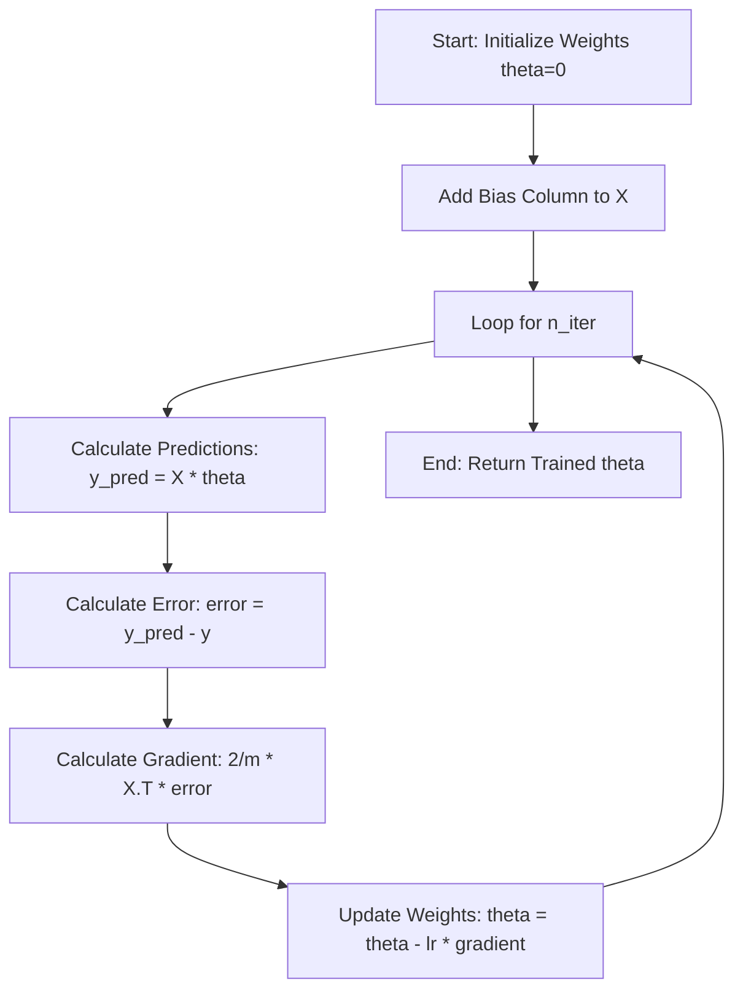
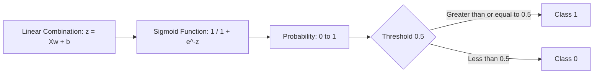
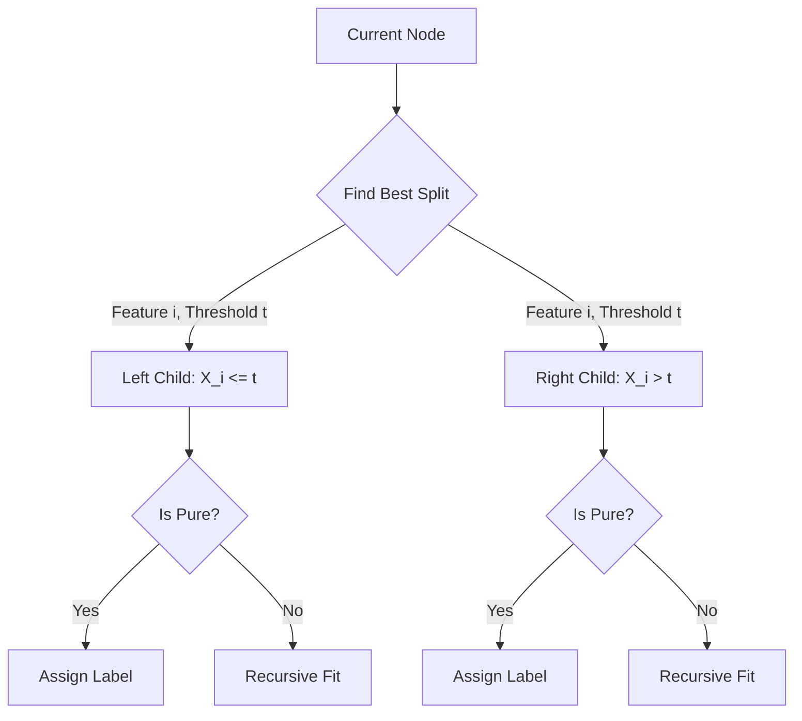
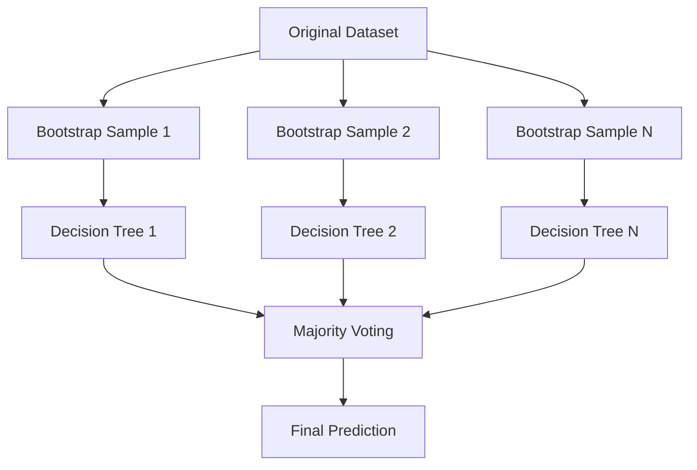
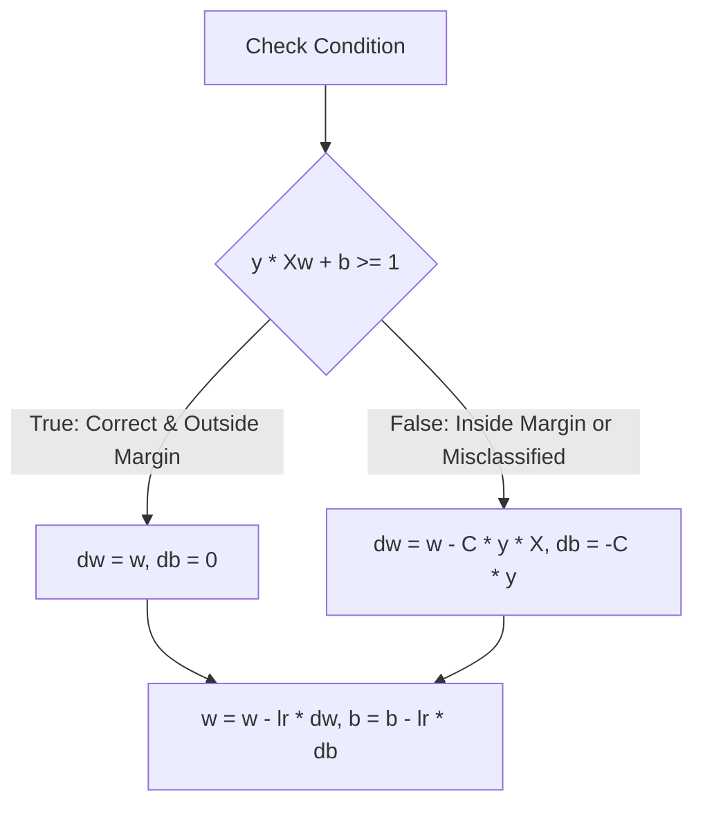

# ML Models Diagrams

## Linear Regression Process

```mermaid
graph TD
    A[Start: Initialize Weights theta=0] --> B[Add Bias Column to X]
    B --> C[Loop for n_iter]
    C --> D[Calculate Predictions: y_pred = X * theta]
    D --> E[Calculate Error: error = y_pred - y]
    E --> F[Calculate Gradient: 2/m * X.T * error]
    F --> G[Update Weights: theta = theta - lr * gradient]
    G --> C
    C --> H[End: Return Trained theta]
```

## Logistic Regression Sigmoid

```mermaid
graph LR
    Z[Linear Combination: z = Xw + b] --> S[Sigmoid Function: 1 / 1 + e^-z]
    S --> P[Probability: 0 to 1]
    P --> C{Threshold 0.5}
    C -->|Greater than or equal to 0.5| Class1[Class 1]
    C -->|Less than 0.5| Class0[Class 0]
```

## Decision Tree Split Logic

```mermaid
graph TD
    Root[Current Node] --> Split{Find Best Split}
    Split -->|Feature i, Threshold t| Left[Left Child: X_i <= t]
    Split -->|Feature i, Threshold t| Right[Right Child: X_i > t]
    Left --> LeafL{Is Pure?}
    Right --> LeafR{Is Pure?}
    LeafL -->|Yes| LabelL[Assign Label]
    LeafL -->|No| RecL[Recursive Fit]
    LeafR -->|Yes| LabelR[Assign Label]
    LeafR -->|No| RecR[Recursive Fit]
```

## Random Forest Architecture

```mermaid
graph TD
    Data[Original Dataset] --> B1[Bootstrap Sample 1]
    Data --> B2[Bootstrap Sample 2]
    Data --> BN[Bootstrap Sample N]
    B1 --> T1[Decision Tree 1]
    B2 --> T2[Decision Tree 2]
    BN --> TN[Decision Tree N]
    T1 --> V[Majority Voting]
    T2 --> V
    TN --> V
    V --> Final[Final Prediction]
```

## SVM Hinge Loss Update

```mermaid
graph TD
    Start[Check Condition] --> Cond{y * Xw + b >= 1}
    Cond -->|True: Correct & Outside Margin| Update1[dw = w, db = 0]
    Cond -->|False: Inside Margin or Misclassified| Update2[dw = w - C * y * X, db = -C * y]
    Update1 --> Step[w = w - lr * dw, b = b - lr * db]
    Update2 --> Step
```
